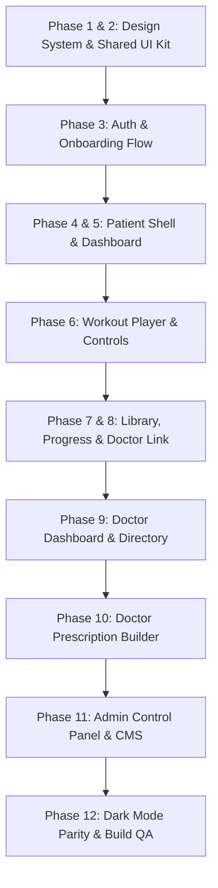
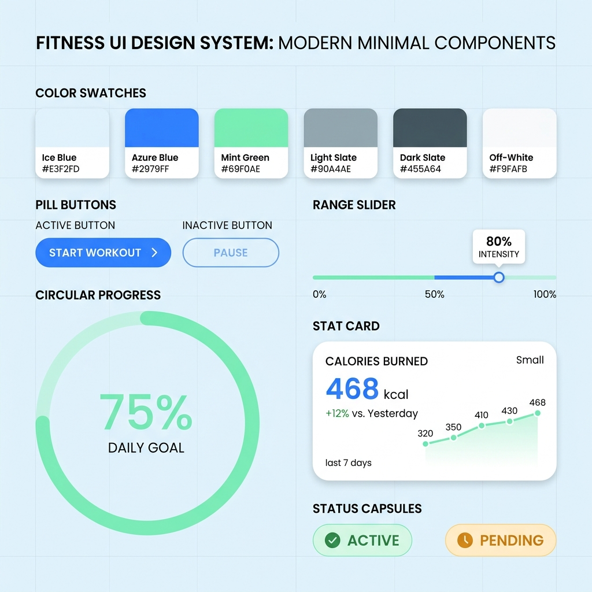
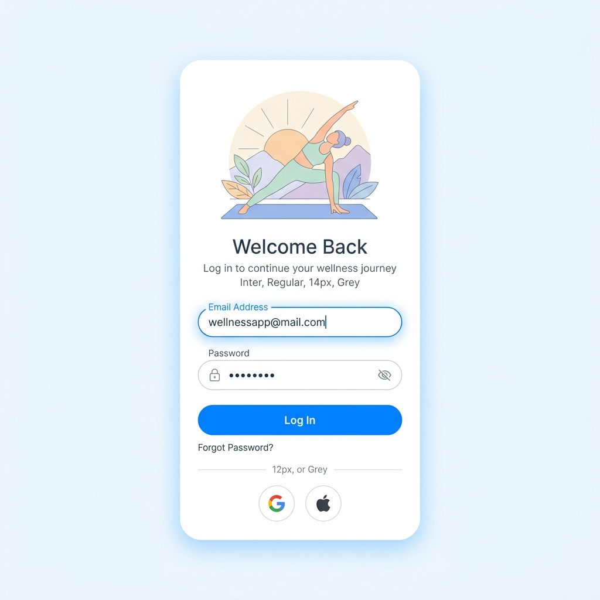
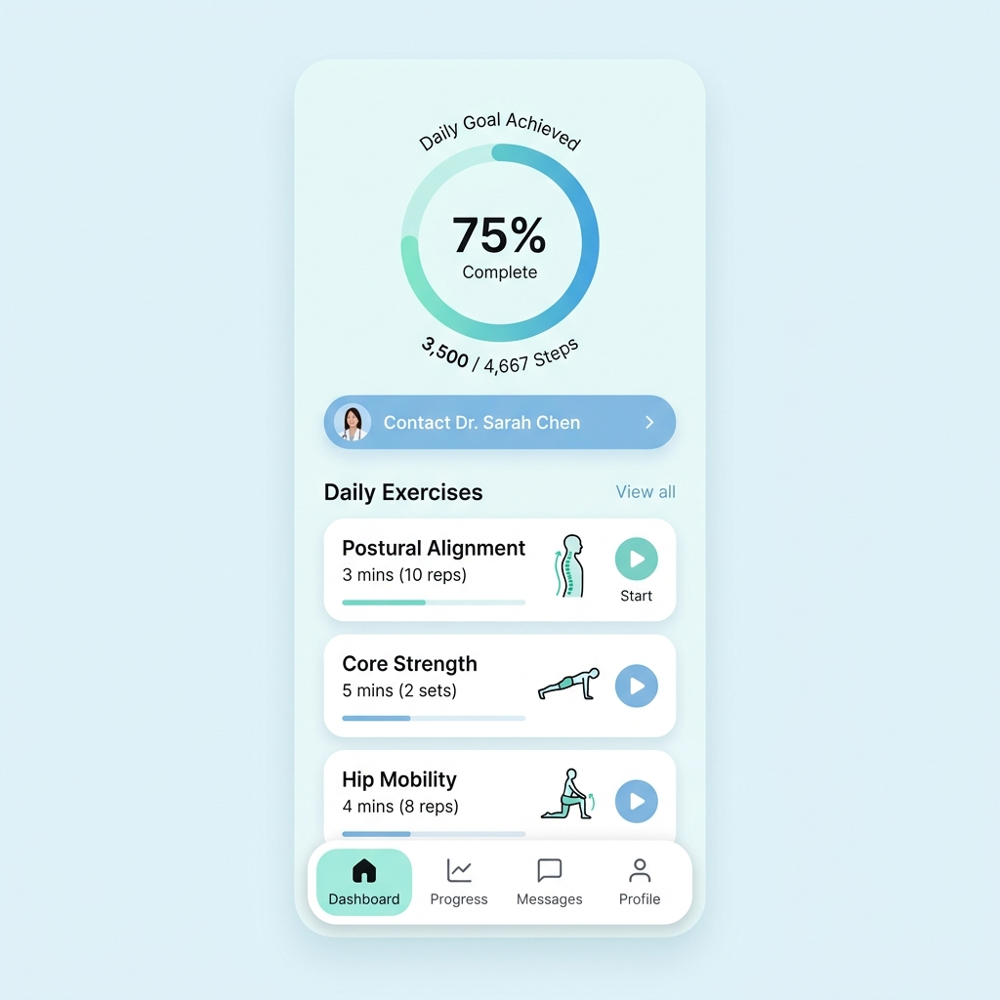
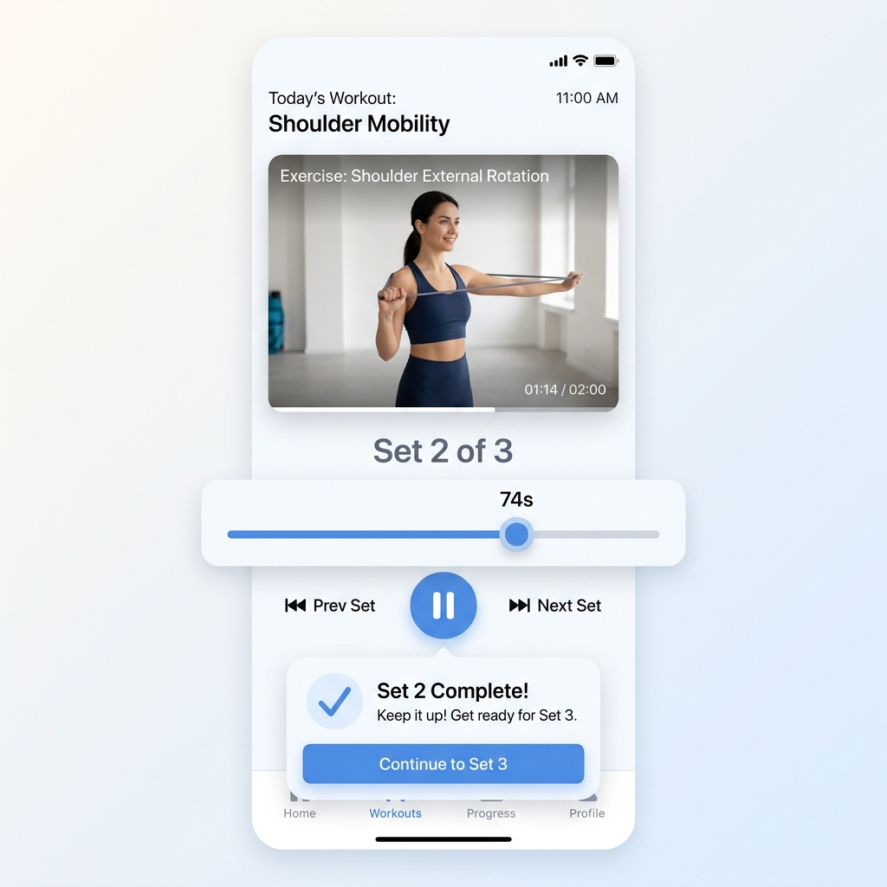
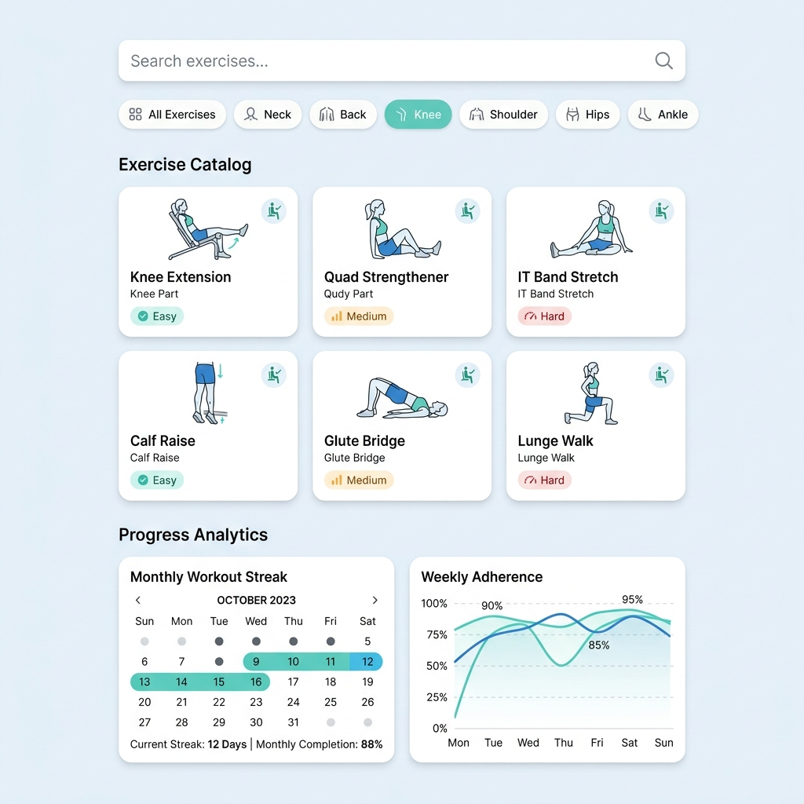
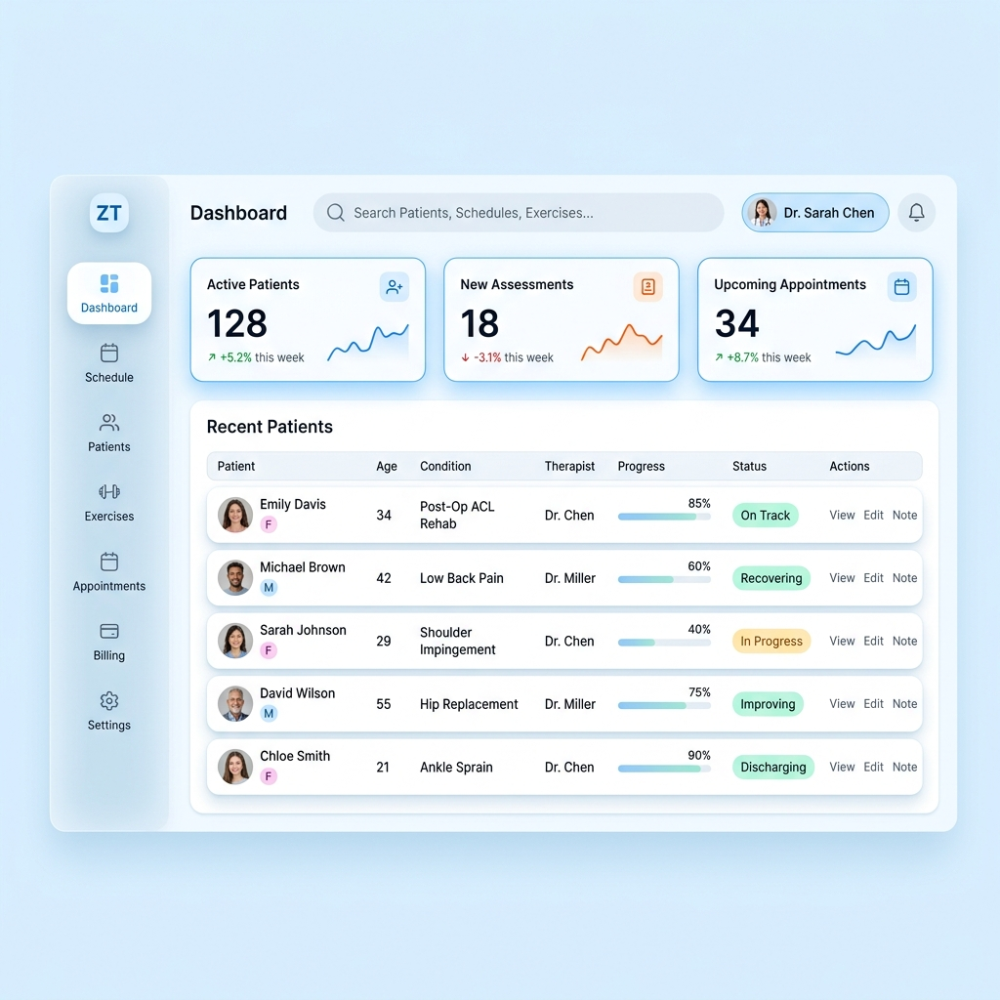
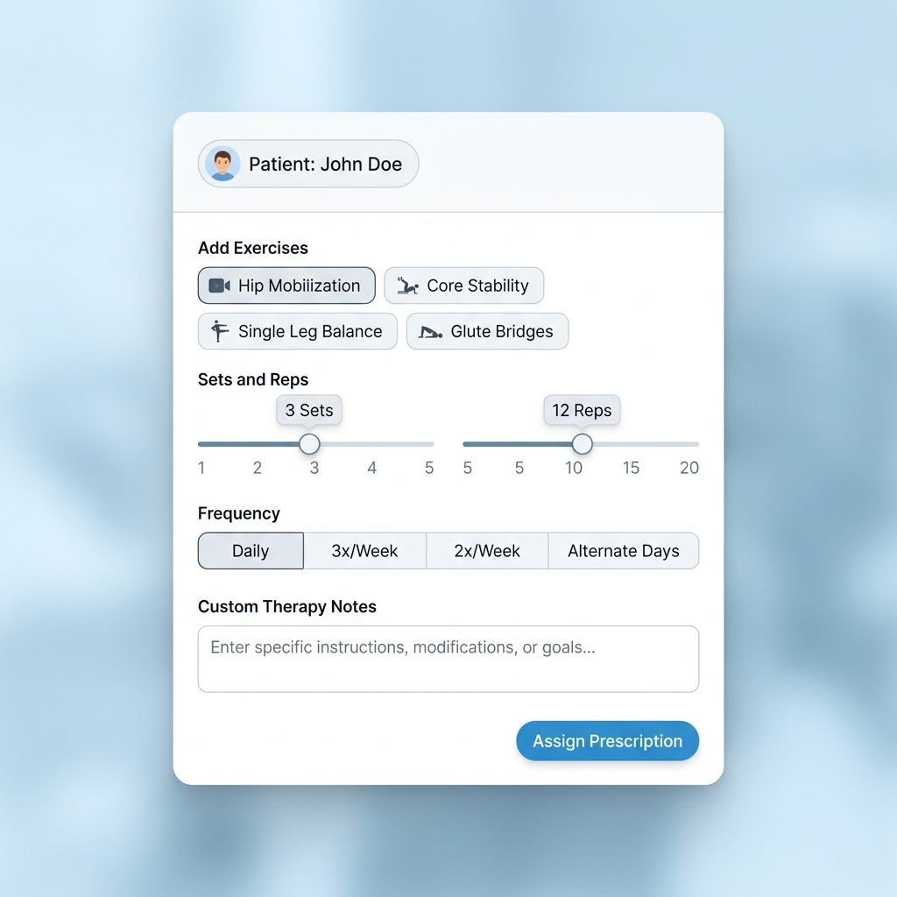
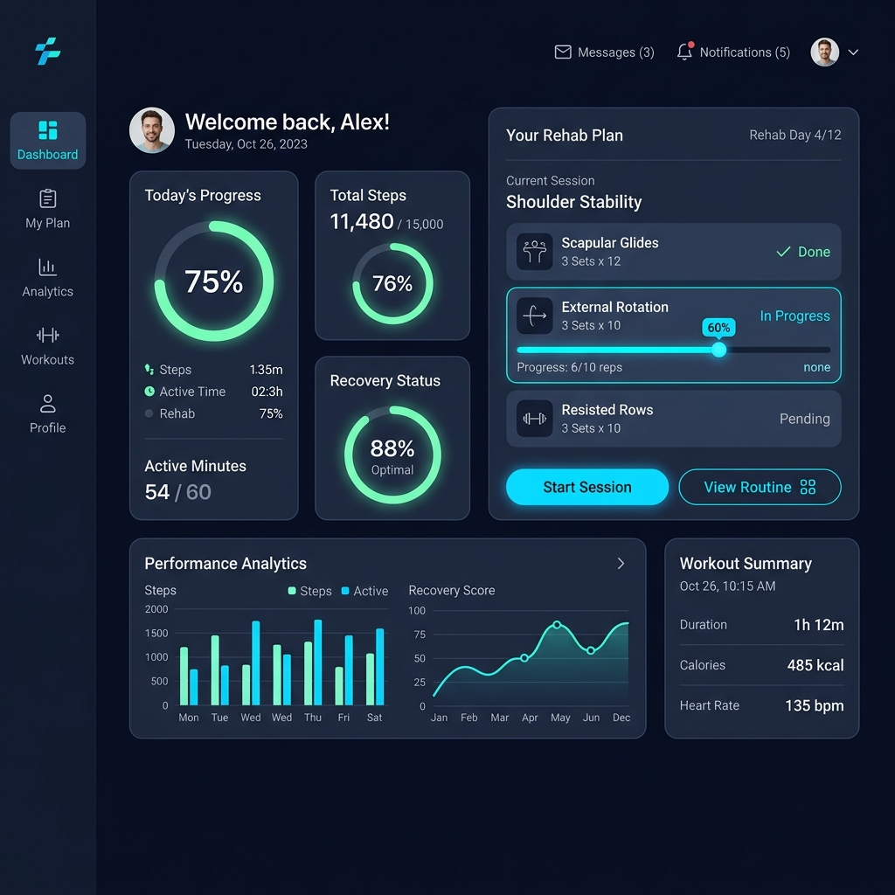

# Phisio Web — Redesign Roadmap & Phase Moodboards

Phase breakdown and deliverables for the redesign.

> **Option A (active):** Preview images are **inspiration only**. Visual acceptance is defined by [`DESIGN_SYSTEM.md`](./DESIGN_SYSTEM.md). The product is Persian RTL with real data — do not chase English PNG layouts.

---

## 🗺️ Master 12-Phase Visual Roadmap

---

## 🎨 Phase-by-Phase Expectations & Visual Previews

### 🔹 Phase 1 & 2: Design Tokens & Core Shared UI Components
**What to expect**: Overhaul of all styling variables, Ant Design theme tokens, and creation of shared UI primitives (`ExerciseProgressRing`, `TactileSlider`, `StatusCapsule`, `StatCard`, `HeroCard`).

- **Deliverables**:
  - `src/styles/design-tokens.css`: HSL/HEX variables for `--bg-base` (`#F4F8FF`), `--primary` (`#3B82F6`), `--accent-teal` (`#14B8A6`), radiuses (`14px`/`20px`/`28px`/`999px`), and shadow tokens.
  - `src/theme/phisio-theme.ts`: AntD `ThemeConfig` updates (`borderRadius: 16`, `controlHeight: 48`, custom font/shadow settings).
  - `src/components/ui/ExerciseProgressRing.tsx`: SVG animated progress ring with dual-color stroke gradient.
  - `src/components/ui/TactileSlider.tsx`: Custom range slider with circular thumb handle (`24px`) and live pill tooltip.
  - `src/components/ui/StatusCapsule.tsx`: Soft-tint status pill (`Active`, `Pending`, `Completed`).

---

### 🔹 Phase 3: Auth & Onboarding Flow (Login / Register)
**What to expect**: A welcoming login and registration experience featuring floating rounded cards, yoga vector illustration, soft input fields, electric azure pill buttons, and circular social logins.

- **Deliverables**:
  - `src/layouts/AuthLayout.tsx`: Soft ice-blue canvas background with ambient SVG background waves and floating card container (`28px` radius).
  - `src/pages/login/LoginPage.tsx`: Yoga illustration header, rounded floating inputs, azure pill CTA button (`48px` height), circular social login buttons.
  - `src/pages/register/RegisterPage.tsx`: Multi-step onboarding form with tactile inputs and role selector pill buttons.

---

### 🔹 Phase 4 & 5: Patient App Shell & Dashboard Overview
**What to expect**: Mobile-first bottom navigation bar with active floating pill tabs, top hero progress ring, daily adherence status, active doctor link card, and exercise posture list items.

- **Deliverables**:
  - `src/layouts/components/PatientAppShell.tsx`: Bottom tab navigation with active pill indicators, icon scale animations, and backdrop blur.
  - `src/features/patient/exercises/components/PatientDashboard.tsx`: Top hero section with `ExerciseProgressRing`, daily adherence status, active doctor link card, today's exercise cards with posture icons and play pills.

---

### 🔹 Phase 6: Patient Workout Execution & Workout Player
**What to expect**: Interactive full-screen exercise execution view with real-time video/animation frame, set progress counter, `TactileSlider` duration control, play/pause buttons, and celebratory completion popover.

- **Deliverables**:
  - `src/pages/patient/PatientExercisesPage.tsx`: Full-screen workout player layout.
  - `src/features/patient/exercises/components/PatientExercisePlayer.tsx`: Reps/timer view with `TactileSlider`, real-time exercise video container, play/pause controls.
  - `src/components/ui/WorkoutCompletionModal.tsx`: Celebratory modal with animated checkmark and streak increment counter.

---

### 🔹 Phase 7 & 8: Patient Library, Progress Analytics & Doctor Connection
**What to expect**: Exercise catalog grid with search bar, body part filter chips (Neck, Back, Knee, Shoulder), adherence progress calendar, streak counter, doctor search cards, and educational health article reader.

- **Deliverables**:
  - `src/pages/patient/PatientLibraryPage.tsx`: Exercise catalog grid with search bar, body part filter chips (Neck, Back, Shoulder, Knee), difficulty tags, detail drawers.
  - `src/pages/patient/PatientProgressPage.tsx`: Interactive adherence calendar, weekly streak chart, pain score logger, exercise history timeline.
  - `src/pages/patient/PatientDoctorsPage.tsx` & `PatientArticlesPage.tsx`: Doctor search cards, specialty badges, doctor profile view, request connection modal, article reader view.

---

### 🔹 Phase 9: Doctor Dashboard & Patient Management
**What to expect**: Corporate SaaS desktop interface for therapists featuring a floating glass sidebar navigation, top blur header bar, 3-column metric stat cards with sparklines, and recent patient table with rounded rows and status capsules.

- **Deliverables**:
  - `src/layouts/DoctorLayout.tsx`: Modern floating glass sidebar with active menu pills and top header blur bar.
  - `src/pages/doctor/DoctorHomePage.tsx`: Overview stats, patient adherence alert cards, quick actions.
  - `src/pages/doctor/DoctorPatientsPage.tsx` & `src/features/doctor/dashboard/components/RecentPatientsTable.tsx`: Patient directory table/grid, patient health profile drawer, medical history timeline.

---

### 🔹 Phase 10: Doctor Prescription Builder & Exercise Assignment
**What to expect**: Interactive therapist prescription builder modal allowing doctors to select exercise video chips, adjust reps/sets sliders with numerical tooltips, set therapy frequency, and add custom notes for each patient.

- **Deliverables**:
  - `src/pages/doctor/DoctorExercisesPage.tsx`: Doctor exercise library, custom exercise upload/link modal, prescription assignment modal (assign sets, reps, frequency, and custom notes per patient).

---

### 🔹 Phase 11: Admin Control Panel & CMS Management
**What to expect**: Complete administrative platform control panel featuring global usage stats, doctor license verification drawers, and exercise/article content CMS tables.

- **Deliverables**:
  - `src/layouts/AdminLayout.tsx` & `src/pages/admin/AdminDashboardPage.tsx`: Platform health overview stats, doctor approval queue, system metrics.
  - `src/pages/admin/DoctorsPage.tsx` & `PatientsPage.tsx`: Global user directories with status capsules and verification drawers.
  - `src/pages/admin/ExercisesPage.tsx`, `ExerciseCategoriesPage.tsx`, `ArticlesPage.tsx`, `AssignmentsPage.tsx`: Administrative CMS tables, search filters, and content modals.

---

### 🔹 Phase 12: Dark Mode Parity, Micro-Animations & Build QA
**What to expect**: Full dark mode visual parity with deep midnight obsidian navy surfaces (`#0B132B`), glowing electric azure pill buttons (`#3B82F6`), mint teal rings (`#2DD4BF`), smooth tactile press spring dynamics (`scale(0.97)`), and verified production build.

- **Deliverables**:
  - `src/styles/animations.css`: Fine-tune button active press (`scale(0.97)`), card hover lifts (`-4px`), and progress ring stroke keyframes.
  - Accessibility & ARIA Audit: Verify contrast ratios, keyboard focus rings, and screen reader labels.
  - Build Verification: Run `npm run test` and `npm run build` to confirm zero TypeScript compilation or bundle errors.
