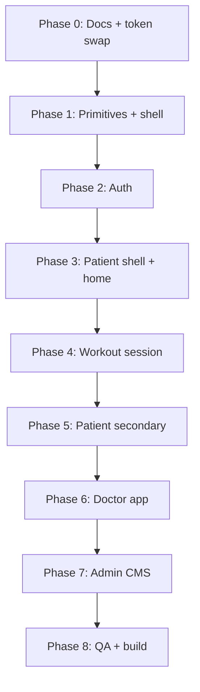

# Phisio — Modern UI Kit (Redesign Target)

> **Active visual direction for the full-app redesign.**  
> Moodboards are inspiration — implement with real Persian RTL data, not English mock copy.  
> Hard no’s: purple gradients, glass blur stacks, neon glow, emoji chrome, fake sparklines.  
> **Brand mark:** keep **Zivan / زیوان** (`ZivanLogo` + `app.name`) — kit PNGs may say Phisio.  
> **Current delivery (user):** kit language everywhere (tokens, Ant controls, shells, shared primitives). Page layout redesigns are a later pass.

**Mood:** Calm · Premium · Medical  
**Feel:** Smooth, simple, modern (cleaner Signal Blue lineage)  
**Primary surface:** Patient mobile first; doctor/admin inherit the same tokens.

Related contract (geometry, density, RTL rules still apply unless this kit overrides color): [`DESIGN_SYSTEM.md`](./DESIGN_SYSTEM.md)

**For AI agents implementing UI:** use [`docs/AI_UI_KIT_SPEC.md`](./docs/AI_UI_KIT_SPEC.md) **together with** the kit image below.

---

## Assets

| Asset | Path | Role |
| :--- | :--- | :--- |
| UI kit (light + dark) | [`docs/preview-assets/phisio_ui_kit_modern_patient_light_dark.png`](./docs/preview-assets/phisio_ui_kit_modern_patient_light_dark.png) | Component vocabulary |
| Login preview | [`docs/preview-assets/phisio_login_page_preview_modern.png`](./docs/preview-assets/phisio_login_page_preview_modern.png) | Auth target (Phase 2) |

---

## Decisions locked

| Topic | Choice |
| :--- | :--- |
| Direction | Keep clinical SaaS; cleaner / simpler / less electric |
| Platform | Patient mobile first |
| Themes | Light + dark parity |
| Geometry | Pill **only** on primary CTA + status capsules; secondary controls use `--phisio-radius` (~14px); cards ~16px |
| Accent | Modern sky-blue + teal for progress only |
| Mood | Calm, premium, medical |

---

## Tokens (target palette)

Replace current Signal Blue `#0057FF` / `#4C9AFF` brand usage with:

| Token | Light | Dark | Role |
| :--- | :--- | :--- | :--- |
| `--phisio-primary` | `#0B7AEA` | `#3B9AFA` | Primary CTAs, active nav, links, focus |
| `--phisio-primary-hover` | `#0969D0` | `#5AADFF` | Primary hover |
| `--phisio-accent` / teal | `#0F9F8A` | `#2DD4B0` | Progress / health / success **only** |
| `--phisio-bg` | `#F6F8FA` | `#0B1220` | Page canvas |
| `--phisio-surface` | `#FFFFFF` | `#152033` | Cards / panels / dock / header |
| `--phisio-bg-elevated` | `#EEF1F4` | `#1C2A3D` | Inputs / nested chrome |
| `--phisio-text` | `#0B1F33` | `#F3F5F7` | Headings & body |
| `--phisio-text-secondary` | `#5B6B7C` | `#9AA6B2` | Meta |
| `--phisio-border` | `#E2E6EB` | `#243247` | Dividers |
| Shadows | Neutral slate / black only | Black | No blue glow |

**Always prefer `var(--phisio-*)` over hard-coded hex in components.**

---

## Kit inventory (must stay consistent)

1. **Buttons** — primary pill; secondary outline ~14px; ghost text  
2. **Inputs** — elevated chrome, search + text  
3. **Status capsules** — soft tint + optional dot (pill OK)  
4. **Exercise progress ring** — teal → sky stroke; center %  
5. **Stat cards** — metric + quiet label; real trends only  
6. **Exercise list rows** — thumb + title + meta + play pill  
7. **Bottom dock** — solid surface, no translucent blur  
8. **Tactile dosage slider** — value pill uses primary soft  
9. **Completion modal** — quiet celebration; no emoji titles  

---

## Product rules (carry from design system)

- No Tailwind — inline styles, CSS modules, or `src/styles/`  
- Patient scroll: dock clearance (`paddingBottom: 88px` / `.patient-content-with-tabs`)  
- Header / sider / dock: **solid** `--phisio-surface` (no glass)  
- RTL default; mixed FA/EN → `<bdi style={{ unicodeBidi: 'plaintext' }}>`  
- Persian digits via `@/utils/persian-format`  
- Section gaps `16–20px`; list row gaps `10–12px`  
- One clear primary action per section  

---

## Full-app redesign phases

Execute in order. Each phase ends with Visual QA: tokens, pill rules, density, RTL + real data, light + dark.

### Phase 0 — Docs & design tokens
**Status:** Done (2026-08-03). Tokens live in CSS + Ant theme; no `#0057FF` / `#4C9AFF` brand primary left in `src/`. Glow shadows disabled (`none`).

### Phase 1 — Shared primitives & app shell
**Status:** Done (2026-08-03). Kit language locked in primitives + Ant + solid shell. Hard-coded media backgrounds use `--phisio-bg`. Page **layout** redesigns wait for a later pass (Auth / Patient / Doctor screens).

| Step | Work |
| :--- | :--- |
| 1.1 | Align shared primitives to kit |
| 1.2 | Buttons: primary pill; secondary `--phisio-radius`; inputs elevated |
| 1.3 | Solid dock / header / sider; flat nav |
| 1.4 | Empty / loading consistent; no idle glow |

**Done when:** Kit rows 1–9 have matching in-app primitives / global controls.

---

### Phase 2 — Auth
**Screens:** Login, Register  
**Preview:** `phisio_login_page_preview_modern.png`

| Step | Work |
| :--- | :--- |
| 2.1 | `AuthLayout` — calm canvas, brand hero, solid card |
| 2.2 | `LoginForm` — phone + password, one pill CTA, text secondary links |
| 2.3 | Register / onboarding — same input + CTA language |
| 2.4 | Light + dark smoke |

**Done when:** Auth matches login preview hierarchy (not pixel-perfect PNG chase).

---

### Phase 3 — Patient shell + home
**Screens:** Patient dock shell, `PatientHomePage` / `PatientDashboard`

| Step | Work |
| :--- | :--- |
| 3.1 | Solid dock; clearance; active tab = primary |
| 3.2 | Home: progress ring hero → today’s exercise rows → secondary |
| 3.3 | One primary “start/continue”; gaps ≤ 20px |
| 3.4 | Light + dark |

**Done when:** First viewport is one clear job (progress + next exercises).

---

### Phase 4 — Workout session
**Screens:** `PatientExerciseSession`, `WorkoutCompletionModal`

| Step | Work |
| :--- | :--- |
| 4.1 | Full-screen focus; media dominant |
| 4.2 | Glass only on over-video controls if needed; rest solid |
| 4.3 | Slider + set progress + primary pill control |
| 4.4 | Quiet completion modal |
| 4.5 | Light + dark |

**Done when:** Session feels medical tool, not game UI.

---

### Phase 5 — Patient secondary pages
**Screens:** Exercises list, Library, Progress, Doctors (+ profile), Articles (+ detail)

| Step | Work |
| :--- | :--- |
| 5.1 | Library — search + soft filter chips (not pill CTA overload) |
| 5.2 | Progress — calendar / streak; teal for adherence only |
| 5.3 | Doctors / articles — list rows + capsules; same empty states |
| 5.4 | Light + dark spot-check each route |

**Done when:** All patient tabs share kit language.

---

### Phase 6 — Doctor app
**Screens:** Doctor home, patients, exercises / prescription modals

| Step | Work |
| :--- | :--- |
| 6.1 | Flat solid sider + header (no glass) |
| 6.2 | Home — few real `StatCard`s + dense `RecentPatientsTable` |
| 6.3 | Patients directory — capsules + drawers |
| 6.4 | Prescription / dosage — `TactileSlider` + one Save pill |
| 6.5 | Light + dark |

**Done when:** Desktop density feels clinical SaaS, same tokens as patient.

---

### Phase 7 — Admin CMS
**Screens:** Admin dashboard, doctors, patients, exercises, categories, articles, assignments

| Step | Work |
| :--- | :--- |
| 7.1 | Same table / filter / capsule patterns as doctor |
| 7.2 | Dashboard stats via `StatCard` only |
| 7.3 | Light + dark spot-check |

**Done when:** Admin does not introduce a third visual language.

---

### Phase 8 — Final QA & build
| Step | Work |
| :--- | :--- |
| 8.1 | Side-by-side kit PNG vs priority screens |
| 8.2 | Pill / token / density / RTL audit |
| 8.3 | Light + dark on Auth, Patient home, Workout, Doctor home, Prescription |
| 8.4 | `npm run test` + `npm run build` |

---

## Page → phase map

| Area | Pages / surfaces | Phase |
| :--- | :--- | :--- |
| Foundation | Tokens, theme, primitives, shell | 0–1 |
| Auth | Login, Register | 2 |
| Patient core | Dock, Home / dashboard | 3 |
| Patient session | Workout player, completion | 4 |
| Patient rest | Library, Progress, Doctors, Articles, Exercises | 5 |
| Doctor | Home, Patients, Exercises / assign | 6 |
| Admin | Dashboard + CMS tables | 7 |
| Ship | QA + build | 8 |

---

## Preview backlog (generate before coding each phase)

| Phase | Preview to add under `docs/preview-assets/` |
| :--- | :--- |
| 2 | Login *(done)* · Register |
| 3 | Patient home + dock |
| 4 | Workout session + completion |
| 5 | Library · Progress · Doctors · Articles |
| 6 | Doctor home · Prescription modal |
| 7 | Admin dashboard (optional) |

---

## Visual QA checklist (every phase)

1. Matches this kit (not old Signal Blue / glass moodboards as truth)  
2. Tokens used — no stray brand hex  
3. Pill only on primary CTA + status  
4. Density: section gaps ≤ 20px  
5. Persian RTL + real data  
6. Light + dark smoke  

---

*Kit locked 2026-08-03 — modern sky-blue `#0B7AEA` + progress teal `#0F9F8A`; patient mobile first.*
