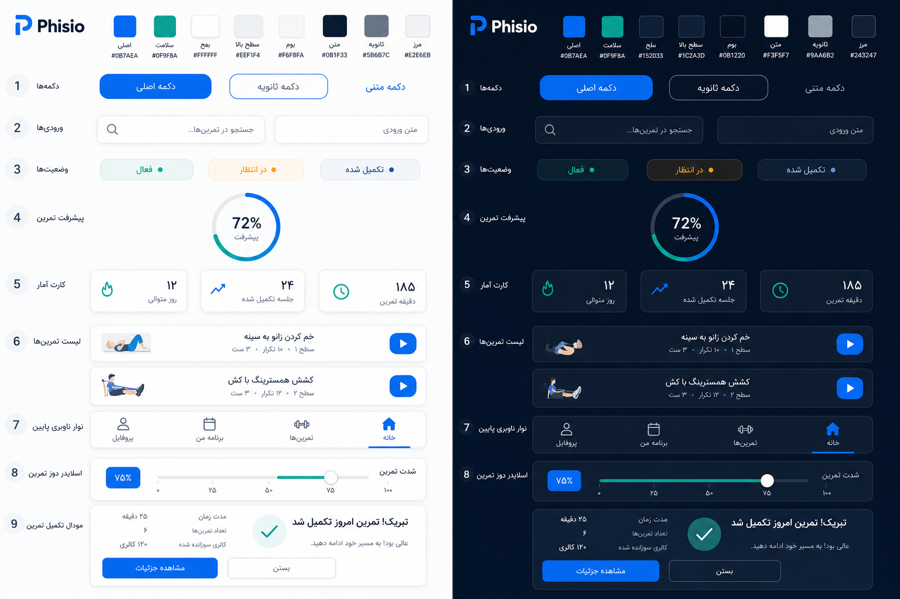

# AI UI Implementation Spec — Zivan (Phisio kit)

> **Who this is for:** Any AI agent implementing or redesigning UI in `phisio-web`.  
> **How to use:** Open **both** this file **and** the kit image. Treat them as one contract.  
> **Do not** invent a new palette, glass UI, or wellness marketing layout.

## Mandatory companion asset

| Asset | Path |
| :--- | :--- |
| UI kit (light + dark) | [`preview-assets/phisio_ui_kit_modern_patient_light_dark.png`](./preview-assets/phisio_ui_kit_modern_patient_light_dark.png) |
| Product roadmap / phases | [`../UI_KIT.md`](../UI_KIT.md) |
| Geometry / RTL / density | [`../DESIGN_SYSTEM.md`](../DESIGN_SYSTEM.md) |



**Acceptance rule:** Match the **component language** in the image (colors, radius roles, hierarchy). Do **not** chase English PNG copy or pixel-perfect mock layout. Product is **Persian RTL** with **real data**.

---

## 0. Product facts (do not change)

| Fact | Value |
| :--- | :--- |
| App brand | **Zivan / زیوان** — use `ZivanLogo` + `t('app.name')`. Kit may say “Phisio”; ignore that wordmark. |
| Direction | `dir="rtl"` by default |
| Stack | React + Ant Design. **No Tailwind.** Use `var(--phisio-*)`, inline styles, or CSS under `src/styles/`. |
| Font | `Vazirmatn, Inter, system-ui, sans-serif` |
| Digits | Persian via `formatPersianNumber` / `convertToPersianDigits` from `@/utils/persian-format` |
| Mixed FA/EN titles | `<bdi style={{ unicodeBidi: 'plaintext' }}>` + ellipsis |
| Mood | Calm · Premium · Medical — clinical SaaS, not fitness Instagram |

---

## 1. Hard rules (AI must obey)

### Do
- Use CSS variables `var(--phisio-*)` for all brand colors
- Primary blue only for CTAs, active nav, links, focus
- Teal only for progress / health / success / active status
- Pill radius (`9999px` / `--phisio-radius-pill`) **only** on: primary CTA buttons + status capsules
- Cards / panels: `--phisio-radius-md` (16px); hero: `--phisio-radius-lg` (20px); modals: `--phisio-radius-xl` (28px)
- Secondary / default buttons: `--phisio-radius` (14px), outline or ghost — **not** pill
- Solid header / sider / bottom dock — **no** glass / backdrop blur on chrome
- Section gaps `16–20px`; list row gaps `10–12px`
- One primary action per section
- Light + dark via `data-theme` on `<html>` (tokens already switch)

### Don’t
- Purple gradients, neon glow, blue-tinted shadows
- Glass blur stacks on idle UI (exception: over-video workout controls only)
- Emoji in UI chrome / modal titles
- Fake sparklines as decoration
- Hard-code `#0057FF`, `#4C9AFF`, Ant default blue, or random hex for brand
- Replace Zivan logo with Phisio wordmark from the PNG
- Copy English mock labels from moodboards into production UI

---

## 2. Color tokens (canonical)

Defined in code: `src/styles/design-tokens.css` (dark default) + `src/styles/theme.css` (light) + `src/theme/phisio-theme.ts`.

| Token | Light | Dark | Role |
| :--- | :--- | :--- | :--- |
| `--phisio-primary` | `#0B7AEA` | `#3B9AFA` | Primary CTA, active tab, links |
| `--phisio-primary-hover` | `#0969D0` | `#5AADFF` | Hover |
| `--phisio-primary-soft` | soft blue wash | soft blue wash | Selected bg, chips |
| `--phisio-accent` / `--phisio-teal` | `#0F9F8A` | `#2DD4B0` | Progress / health only |
| `--phisio-accent-soft` | soft teal wash | soft teal wash | Active status bg |
| `--phisio-bg` | `#F6F8FA` | `#0B1220` | Page canvas |
| `--phisio-surface` | `#FFFFFF` | `#152033` | Cards, dock, header, panels |
| `--phisio-bg-elevated` | `#EEF1F4` | `#1C2A3D` | Inputs, nested chrome |
| `--phisio-text` | `#0B1F33` | `#F3F5F7` | Titles & body |
| `--phisio-text-secondary` | `#5B6B7C` | `#9AA6B2` | Meta / labels |
| `--phisio-border` | `#E2E6EB` | `#243247` | Dividers / outlines |
| `--phisio-warning` | `#D97706` | `#FBBF24` | Pending |
| `--phisio-danger` | `#DC2626` | `#F87171` | Error / cancel |
| `--phisio-success` | same as teal | same as teal | Success |
| Shadows | neutral slate only | black only | **No glow** (`--phisio-shadow-glow-*` = `none`) |
| `--phisio-brand-gradient` | teal → primary | teal → primary | Progress ring / slider track only |

**Kit image note:** Swatches in the PNG map to these tokens. Prefer the table above over guessing hex from the image.

---

## 3. Typography

| Role | Size token / value | Weight |
| :--- | :--- | :--- |
| Page title | `--phisio-font-title` ≈ `1.5rem` | 700–800 |
| Section title | `1.125–1.25rem` | 700 |
| Body | `--phisio-font-body` ≈ `0.95rem` | 400–500 |
| Meta / labels | `--phisio-font-meta` ≈ `0.82rem` | 500–600 |
| Stat number | `1.5–1.75rem` | 800 |
| Progress % | ~`1–1.25rem` | 800 |

Line-height ≈ 1.5–1.6.

---

## 4. Component inventory (map kit rows → code)

Implement or reuse these. Prefer existing primitives under `src/components/ui/`.

### 4.1 Buttons (kit row 1)

| Variant | Look | Code path |
| :--- | :--- | :--- |
| Primary | Solid `--phisio-primary`, white label, **pill** | Ant `Button type="primary"` + `antd-overrides.css` |
| Secondary | Surface + `--phisio-border`, text `--phisio-text` or primary on hover, radius **14px** | Ant `Button` default |
| Ghost / text | No fill, primary text | Ant `Button type="link"` or text link |

Press: subtle `scale(0.97)`. No colored button glow.

### 4.2 Inputs (kit row 2)

- Background: `--phisio-bg-elevated`
- Border: `--phisio-border`; focus: primary + soft ring (`--phisio-primary-muted`)
- Radius: `--phisio-radius` (14px)
- Search: prefix/suffix icon in secondary color
- Height: large controls ≈ 44–48px (`--phisio-control-height-lg`)

### 4.3 Status capsules (kit row 3)

Component: `StatusCapsule`

| Status | Color language |
| :--- | :--- |
| Active | Teal text/dot + `--phisio-accent-soft` bg |
| Pending | Warning text/dot + soft warning bg |
| Completed | Primary text/dot + `--phisio-primary-soft` bg |

Pill shape OK. Optional leading dot. Font ~11px / 600.

### 4.4 Progress ring (kit row 4)

Component: `ExerciseProgressRing`

- Track: muted border
- Stroke: gradient teal → primary (`--phisio-brand-gradient` stops)
- Center: bold % (Persian digits in FA)
- Optional sublabel under % in secondary text

### 4.5 Stat cards (kit row 5)

Component: `StatCard`

- Surface card, radius 16px, thin border, `--phisio-shadow-sm`
- Icon in soft tint square (primary or teal)
- Large number (800) + quiet meta label
- Real trends only; `showSparkline` default **off**

### 4.6 Exercise list rows (kit row 6)

Pattern (compose; may live in feature components):

```
[thumb 16:10 or square]  [title + meta]  [play — primary pill/circle]
```

- Row surface: `--phisio-surface` or elevated, radius ~14–16px
- Title: `--phisio-text` bold; meta: secondary + Persian digits for sets/reps
- Play control: primary only; one clear action
- Gap between rows: 10–12px

### 4.7 Bottom dock (kit row 7)

CSS: `.dock-nav` in `energetic-dark.css` / patient shell

- Fixed bottom, **solid** `--phisio-surface`, top border, no blur
- 4–5 items: icon + label
- Active: primary color + `--phisio-primary-soft` bg (or underline indicator)
- Patient scroll: `paddingBottom: 88px` / `.patient-content-with-tabs`

### 4.8 Dosage / intensity slider (kit row 8)

Component: `TactileSlider`

- Label left/start; **value pill** (primary soft bg, primary text, pill radius)
- Track fill: brand gradient (teal → blue)
- Thumb: circular, primary ring
- No always-on glow tooltip clutter

### 4.9 Completion modal (kit row 9)

Component: `WorkoutCompletionModal`

- Modal radius `--phisio-radius-xl`
- Quiet teal check circle (not emoji)
- Title + short subtitle in FA from i18n / existing copy
- Summary stats in elevated mini-cards
- Primary pill CTA + secondary 14px outline button
- No celebratory confetti / emoji titles

### 4.10 Also required (not numbered on kit but used everywhere)

| Primitive | Path |
| :--- | :--- |
| `HeroCard` | soft chip badge + optional progress ring |
| `WarmEmptyState` / `AppEmpty` | calm empty; secondary icon color |
| `LoadingState` | Spin + secondary tip |
| `AppTable` | dense tables + `StatusCapsule` |
| `AppBrand` / `ZivanLogo` | mark only; no fake Phisio wordmark |

---

## 5. Layout shells

| Shell | Rules |
| :--- | :--- |
| Patient | Mobile-first; solid dock; content max width; dock clearance |
| Doctor / Admin | Desktop; solid sider + header; flat `.nav-card` list (not card stack); active = primary soft |
| Auth | Solid surface card; calm canvas; `ZivanLogo` + app name; one primary pill CTA |

Workout session may use limited glass **only** on controls over video. Everything else solid.

---

## 6. Code touchpoints (where kit lives)

| Concern | Files |
| :--- | :--- |
| Dark tokens | `src/styles/design-tokens.css` |
| Light tokens | `src/styles/theme.css` |
| Ant theme | `src/theme/phisio-theme.ts` |
| Buttons / inputs / cards | `src/styles/antd-overrides.css` |
| Dock / nav / empty | `src/styles/energetic-dark.css`, `src/styles/app-shell.css` |
| Motion | `src/styles/animations.css` — no idle pulse/glow |
| Primitives | `src/components/ui/*` |
| Brand | `src/components/ui/ZivanLogo.tsx`, `/brand/zivan-mark.png` |

When building a new screen: **compose primitives + tokens**. Do not invent parallel status badges or button styles.

---

## 7. AI implementation workflow

1. Read this file + open the kit PNG side by side  
2. Identify which kit rows the screen needs (buttons, list, dock, etc.)  
3. Reuse or extend `src/components/ui` primitives — don’t fork styles  
4. Wire real API/data; FA copy from `src/locales/fa/common.json`  
5. Verify light + dark (`data-theme`)  
6. Run Visual QA below before calling done  

### Prompt snippet (paste into agent tasks)

```text
Implement UI using:
1) docs/AI_UI_KIT_SPEC.md
2) docs/preview-assets/phisio_ui_kit_modern_patient_light_dark.png

Rules: Zivan brand (not Phisio wordmark), Persian RTL, var(--phisio-*),
pill only on primary CTA + StatusCapsule, solid chrome (no glass),
teal only for progress/health. No Tailwind. Prefer existing ui/ primitives.
```

---

## 8. Visual QA checklist

- [ ] Kit PNG component language matches (not old Signal Blue / glass demos)  
- [ ] Only `var(--phisio-*)` for brand colors (no stray hex)  
- [ ] Pill only on primary CTA + status capsules  
- [ ] Secondary controls use 14px radius  
- [ ] Dock/header/sider solid; no backdrop blur  
- [ ] Section gaps ≤ 20px; list gaps ~10–12px  
- [ ] Zivan logo preserved  
- [ ] Persian RTL + Persian digits where numbers show  
- [ ] Light and dark both readable  
- [ ] No emoji chrome / glow / purple  

---

## 9. Out of scope for “kit-only” passes

- Redesigning page information architecture unless asked  
- Replacing product name with Phisio  
- Adding Tailwind  
- Pixel-matching English moodboard copy  

---

*Generated for AI implementation from the modern patient UI kit (light + dark). Locked palette: primary `#0B7AEA` / `#3B9AFA`, progress teal `#0F9F8A` / `#2DD4B0`, brand Zivan.*
